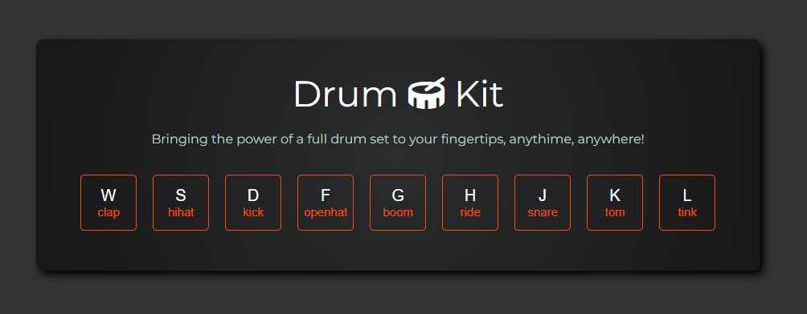
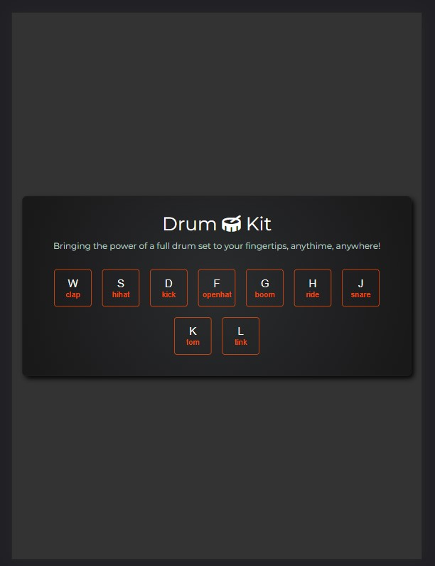
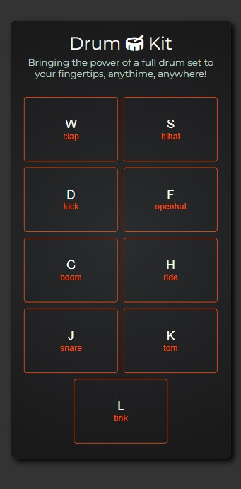

# Drumkit App
This is a simple web application that allows users to play different drum sounds by clicking on the buttons on the screen or pressing the corresponding keys on their keyboard.
Live demo: https://akrzeminska.github.io/drum_kit_js_basic/

## Table of Contents
* [Features](#features)
* [Screenshots](#screenshots)
* [Technologies Used](#technologies-used)
* [Setup](#setup)
* [Usage](#usage)
* [The Road Map](#the-road-map)
* [Project Status](#project-status)
* [Credits](#credits)
* [Author](#author)

## Features
List features here:
- The user can press the corresponding keys on their keyboard to play the drum sounds.
- The user can also click on the buttons on the page to play the drum sounds.
- Each button corresponds to a specific drum sound.
- Responsive design for mobile, tablet and desktop.

## Screenshots
Web version:  

Tablet version:  

Mobile version:  

## Technologies Used
This app was built using:
- HTML
- CSS/SCSS
- JavaScript

## Setup
To use this application, simply clone the repository and open the index.html file in your preferred web browser.

`index.html`

## Usage
Once the application is open, you can start playing the drums by clicking on the drum images or pressing the corresponding keys on your keyboard. 

The keys and their corresponding sounds are as follows:

- W: clap
- S: hihat
- D: kick
- F: openhat
- G: boom
- H: ride
- J: snare
- K: tom
- L: tink

## The Road Map
In the future, I would like to add the ability for users to record and save their drum beats. I would also like to add more drum sounds and the ability to customize the layout of the buttons.

## Project Status
Project is: _completed_

## Credits
This application was built using the following resources:

- Sounds from FreeSound.org
- Icons from FontAwesome.com

## Author
Created by _Adelina Krzemińska_